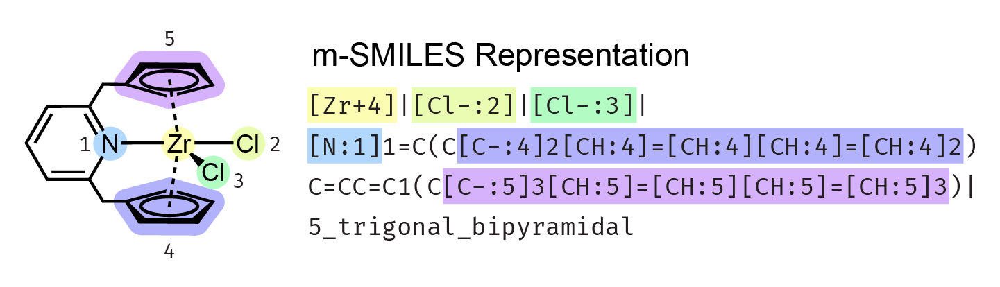
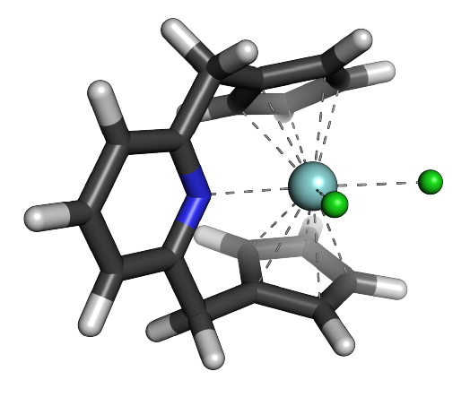
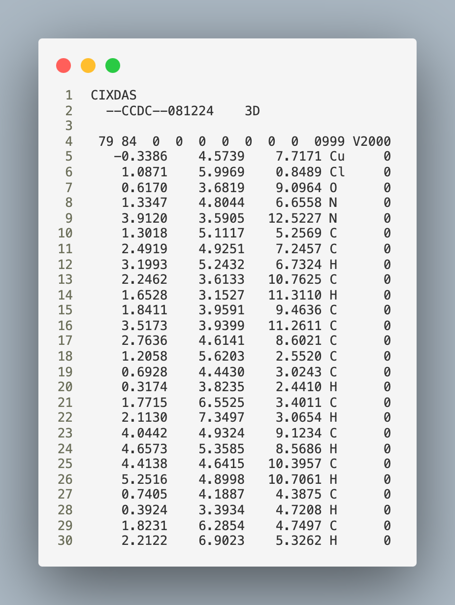
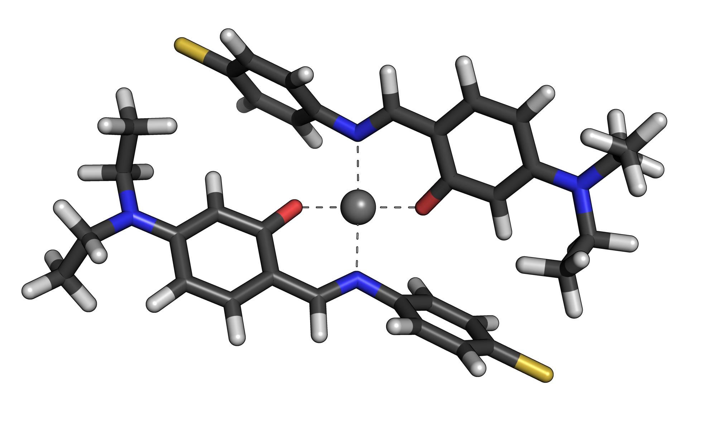

# MetalloGen

A Python package for generating 3D structures of organometallic complexes.

---

# Requirements

- Python ≥ 3.9  
- [NumPy](https://numpy.org/)
- [SciPy](https://scipy.org/)
- [cclib](https://cclib.github.io/)
- [RDKit](https://www.rdkit.org/)
- [PuLP](https://coin-or.github.io/pulp/)

---

# Settings

Before using MetalloGen, following things should be prepared:

1. Quantum chemistry (QC) package should be configured. For example, if users want to use Guassian, either 'which g09', or 'which g16' should be correctly identified, as following:

    ```jsx
    >> which g09
    >> /appl/g09.shchoi/G09Files/g09/g09

    >> which xtb
    >> /home/rxn_grp/programs/xtb
    ```

2. If you want to use our **default method ('xtb-gaussian')**, you must set an environment variable **'xtbbin'** should be specified as following:

    - You can obtain `xtb-gaussian` from the [Aspuru-Guzik Group GitHub repository](https://github.com/aspuru-guzik-group/xtb-gaussian).  
    - After installation, set the environment variable:
    ```jsx
    >> export xtbbin="/home/rxn_grp/programs/xtb-gaussian"
    ```
    - Verify:
    ```jsx
    >> echo $xtbbin
    >> /home/rxn_grp/programs/xtb-gaussian
    ```

# Installation

```jsx
# Clone the repository
>> git clone https://github.com/kyunghoonlee777/MetalloGen.git
>> cd MetalloGen

# Create environment
>> conda create -n metallogen python=3.9 -y
>> conda activate metallogen

# Install MetalloGen
>> pip install -e .
```

---

# Executing MetalloGen

MetalloGen can be executed with two types of inputs:

1. **m-SMILES representation** (modified SMILES for mononuclear coordination complexes)  
2. **MOL/SDF files** containing predefined molecular structures

---

## 1. Using m-SMILES

MetalloGen uses a modified SMILES representation called **m-SMILES** as input. From an m-SMILES string, MetalloGen generates the corresponding 3D conformers.

<p align="center">
  
</p>

The m-SMILES representation encodes:
- the **metal center** (e.g., `[Zr+4]`)
- the **ligands** as SMILES strings separated by vertical bars (`|`)
- the **coordination geometry** (e.g., `5_trigonal_bipyramidal`)

Donor atoms directly coordinated to the metal are specified with square brackets, and coordination sites are indicated with atom mapping numbers (e.g., `[Cl-:2]` means a chloro ligand bound at coordination site 2).  
This makes it straightforward to encode polydentate and polyhapto ligands while preserving coordination geometry and stereochemistry.

**Example (m-SMILES input):**

```jsx
metallogen -s "[Zr+4]|[Cl-:2]|[Cl-:3]|[N:1]1=C(C[C-:4]2[CH:4]=[CH:4][CH:4]=[CH:4]2)C=CC=C1(C[C-:5]3[CH:5]=[CH:5][CH:5]=[CH:5]3)|5_trigonal_bipyramidal" -wd <WORKING DIRECTORY> -sd <SAVE DIRECTORY> -r 1 -nc 1
```

The generated 3D conformer corresponding to the m-SMILES input is shown below:

<p align="center">
  
</p>

---

## 2. Using MOL/SDF files

In some cases—such as **benchmarking with CSD (Cambridge Structural Database)**—obtaining an m-SMILES representation can be challenging or impractical.
For these situations, MetalloGen can directly take **MOL** or **SDF** files as input via the `-id` flag. This allows seamless use of existing 3D structures extracted from databases.

As an example, consider a complex extracted from the CSD with refcode **'TIMJUU'**.
The corresponding 3D structure (in SDF format) can be provided directly to MetalloGen:

<p align="center"> 
   
</p>

**Example (SDF input):**

```jsx
metallogen -id <INPUT DIRECTORY> -wd <WORKING DIRECTORY> -sd <SAVE DIRECTORY> -r 1 -nc 1
```

MetalloGen successfully generates well-formed conformers from such SDF inputs as well:

<p align="center"> 
   
</p>

---

# Output

When running MetalloGen, two types of output are generated:

1. **Conformers**  
   - For each input, the number of conformers specified by the user (via the `-nc` option) are generated.
   - These conformers differ by the initial embedding conditions used in the generation procedure.
   - Each conformer is saved as an **`result_{i}.xyz` file** in the directory specified by `--save_directory`.

2. **Quantum chemical calculation logs**  
   - During the conformer generation process, intermediate quantum chemical calculation outputs (e.g., Gaussian or xTB logs) are written to the directory specified by `--working_directory`.  
   - For **final relaxation (`--final_relax`)**, both the **input files** and **log files** are saved in the directory specified by `--save_directory`.  
   - This allows the final relaxed conformers and their corresponding QC results to be managed together in the same location.

---

# Command-line Arguments

The following options are available:

| Argument | Short | Type | Default | Description |
|----------|-------|------|---------|-------------|
| `--smiles` | `-s` | `str` | `None` | Input MSMILES string |
| `--input_directory` | `-id` | `str` | `None` | Input SDF/MOL file directory |
| `--working_directory` &nbsp;&nbsp;&nbsp;&nbsp;| `-wd` | `str` | `None` | Scratch directory for running quantum chemical calculation |
| `--save_directory` | `-sd` | `str` | `None` | Directory to save the results |
| `--final_relax` | `-r` | `int` | `1` | Whether to perform final relaxation after generation (`0` = no, `1` = yes) |
| `--num_conformer` | `-nc` | `int` | `1` | Number of conformers to generate |

---

# License

This project is licensed under the BSD 3-Clause License.

---

# Contact Information

Please e-mail me to here: [kyunghoonlee@kaist.ac.kr](mailto:kyunghoonlee@kaist.ac.kr) for more detail discussion
